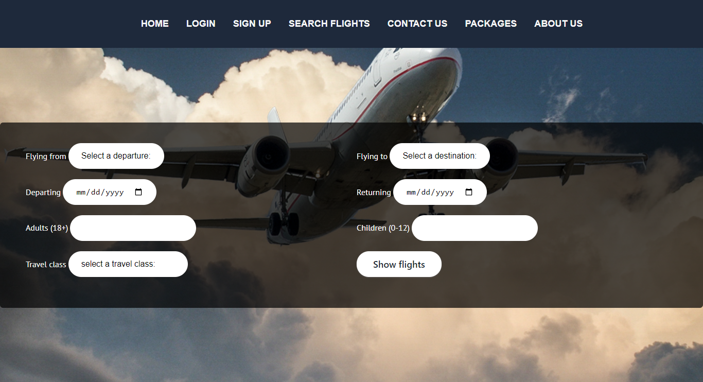
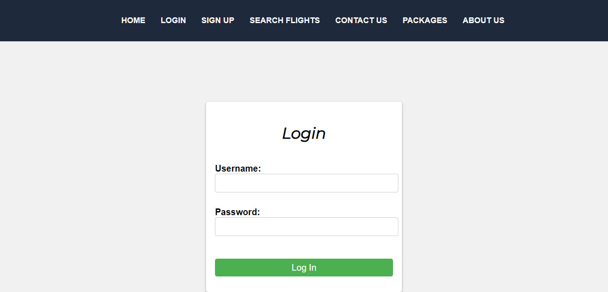
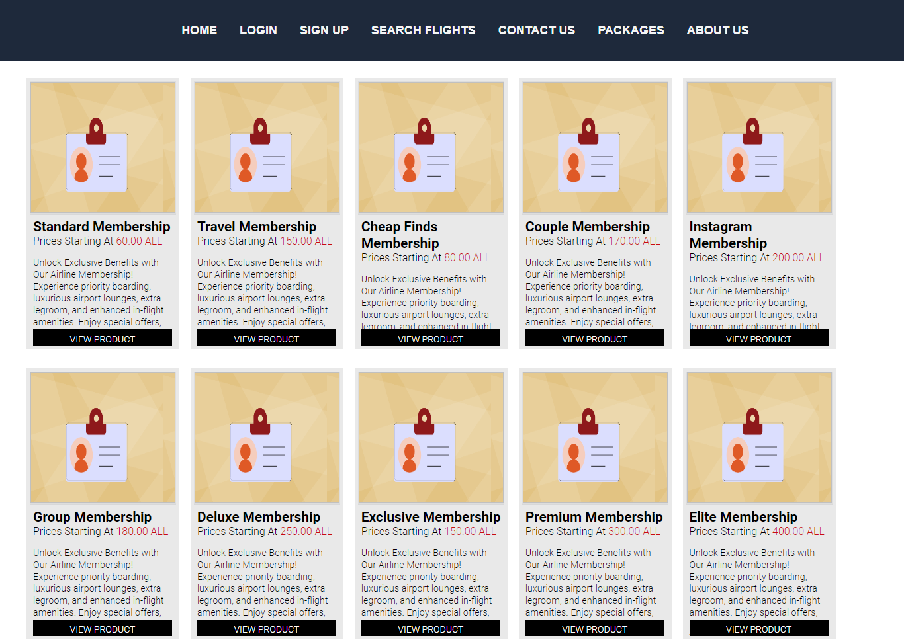
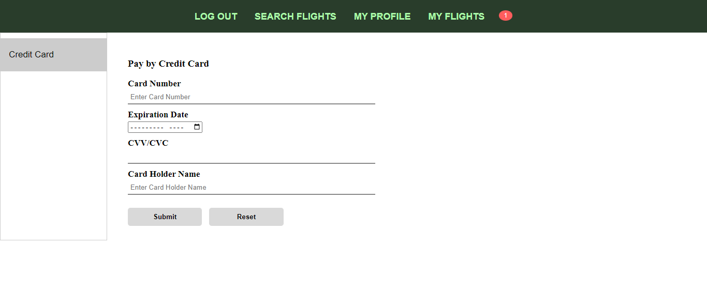
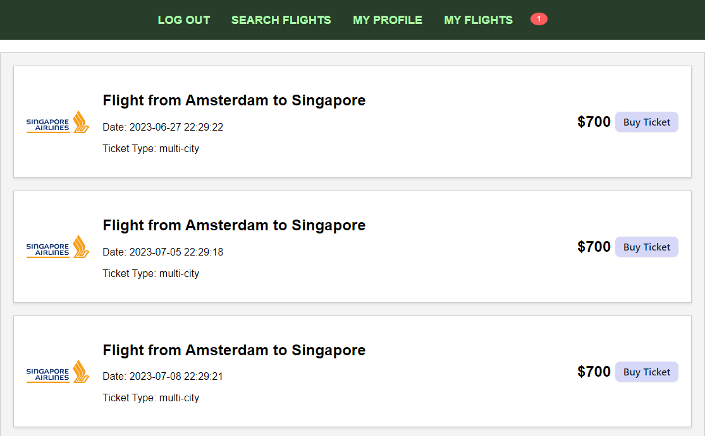
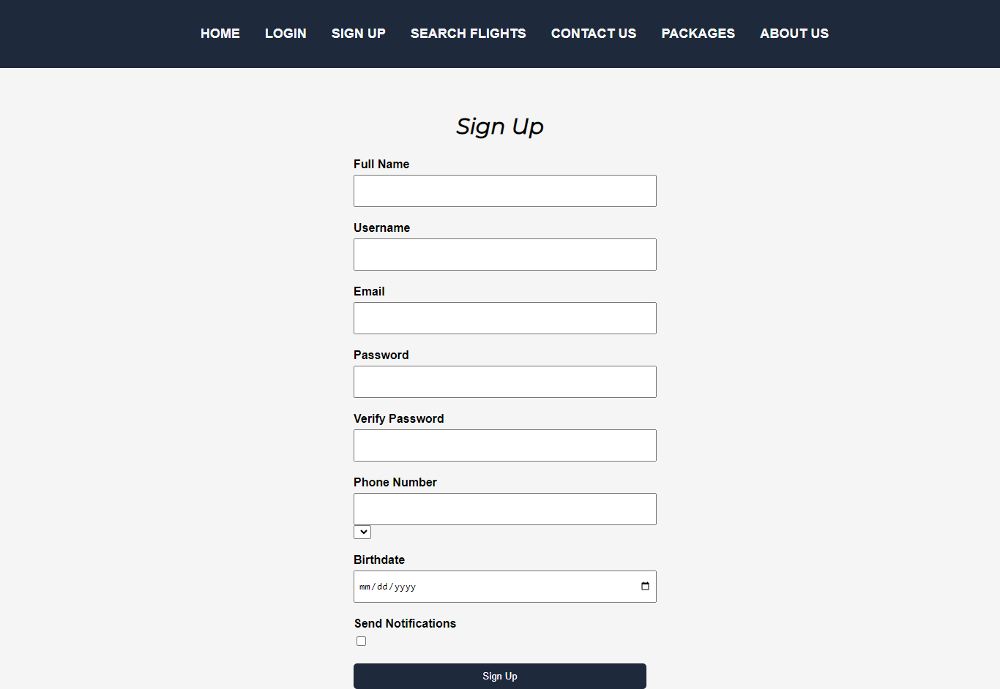
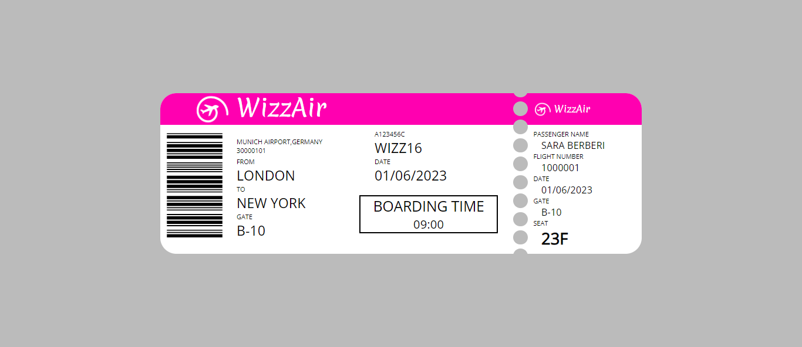

# Prerequisites

This section provides instructions on the necessary requirements and installation process for using the software.

## Technologies used:
[](https://www.php.net/)
[](https://www.mysql.com/)
[](https://www.apachefriends.org/index.html)
[](https://developer.mozilla.org/en-US/docs/Web/JavaScript)
[](https://en.wikipedia.org/wiki/Representational_state_transfer)
[](https://developer.mozilla.org/en-US/docs/Web/HTML)
[](https://developer.mozilla.org/en-US/docs/Web/CSS)


## Clone the repository

To start, clone the repository by executing the following command in your terminal:

```bash
git clone https://github.com/sara-berberi/Flight-Booking-System.git

```
##  Database setup

Create a connection from 'localhost', with username 'root' and no password.
Create a new database schema in phpmyadmin, name it 'webproject'.
Go to ```Flight-Booking-System/Database/tables.sql``` and run it except for the last queries. Then execute the following queries:

Query no.1:
 ```sql
ALTER TABLE transactions
DROP COLUMN transaction_amount
```

Query no.2:
```sql
ALTER TABLE transactions 
DROP COLUMN transactions_ticketQuantity
```
The queries can be easily found in the file, as there is a note indicating their location.

After building the tables fill them with data. Go to ```Flight-Booking-System/Database/insertData.sql``` and execute all the queries in that file. 

Your database is all set. 

## Server setup
Ensure that you have XAMPP server installed and that MySql and Apache are running. If you don't have XAMPP installed, you can download it for your respective operating system from the following link:

[](https://www.apachefriends.org/index.html)

[download XAMPP](https://www.apachefriends.org/download.html)

After installing the server, place the folder of the project in the htdocs directory found in XAMPP folder.
 
The path may look like this: 
```C:\xampp\htdocs\Flight-Booking-System```

After that, your environment is all set. 


# Usage
Here is a simple and concise roadmap to use our website:
``` 
├── Run index.php in your browser. 
├── Press  'Login' and enter your credentials to login or press 'Signup' and enter your credentials to register. 
└── After being logged in, you will be redirected to the searchFlights page by default.
     ├── There you can enter data about your flight and check if there is any ticket available. 
     └── NOTE!- Please choose tickets before '2023-06-02', since that was the last time they  were inserted in the database. There are no tickets after that day.  
     └── If data is found you can book a flight by clicking 'Buy ticket'.
     └── Test example: London to New York, economy flight.  
        ├── Card credentials should have only character '1' repeated or not, or else the payment will fail.
        └── The name of the person should always be entered.
└── Press 'My Profile' to view your profile and press 'Edit Profile' to edit your profile. 
└── Press the red button to view your notifications.
└── Press 'Packages' to view airline memberships.
└── Press 'About us' to learn more about the website. 

```

## Visuals
<div align="center">
  
  
  
  
  
  
  
   
  
    
      
        

## Contributing

Pull requests are welcome. For major changes, please open an issue first
to discuss what you would like to change.

## Contact us

[](mailto:jnase21@epoka.edu.al)

[](mailto:sberberi21@epoka.edu.al)


## License
This project is licensed under the  [](https://choosealicense.com/licenses/mit/)
